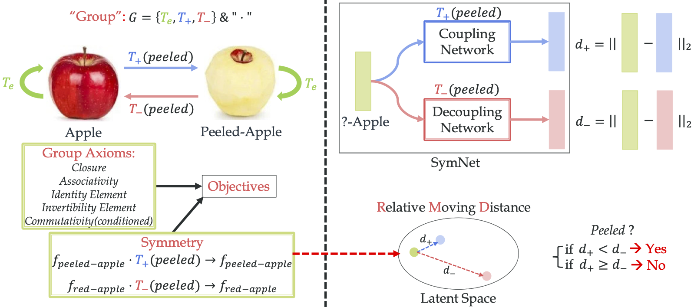

# SymNet
As a part of [HAKE](http://hake-mvig.cn/) project (HAKE-Object).

#### **News**: (2021.2.7) Upgraded [HAKE-Activity2Vec](https://github.com/DirtyHarryLYL/HAKE-Action-Torch/tree/Activity2Vec) is released! Images/Videos --> human box + ID + skeleton + part states + action + representation. [[Description]](https://drive.google.com/file/d/1iZ57hKjus2lKbv1MAB-TLFrChSoWGD5e/view?usp=sharing), Full demo: [[YouTube]](https://t.co/hXiAYPXEuL?amp=1)

(2020.10.27) The code of [IDN](https://github.com/DirtyHarryLYL/HAKE-Action-Torch/tree/IDN-(Integrating-Decomposing-Network)) ([Paper](https://arxiv.org/abs/2010.16219)) in NeurIPS'20 is released!

**(2020.6.16) Our larger version [HAKE-Large](https://github.com/DirtyHarryLYL/HAKE#hake-large-for-instance-level-hoi-detection) (>120K images, activity and part state labels) is released!**

This is the code accompanying the CVPR2020 paper: **Symmetry and Group in Attribute-Object Compositions**. [[arXiv](https://arxiv.org/abs/2004.00587)]

*[Yong-Lu Li](https://dirtyharrylyl.github.io/), [Yue Xu](https://silicx.github.io/), Xiaohan Mao, [Cewu Lu](http://mvig.sjtu.edu.cn/)*

If you find this repository useful for you, please consider citing our paper.

	@inproceedings{li2020symmetry,
		title={Symmetry and Group in Attribute-Object Compositions},
		author={Li, Yong-Lu and Xu, Yue and Mao, Xiaohan and Lu, Cewu},
		booktitle={CVPR},
		year={2020}
	}

## Prerequisites

**Packages**: Install using `pip install -r requirements.txt`

**Datasets**: Download and re-arrange with:
	
	cd data; bash download_data.sh

**Features and pretrained models**: Features for compositional ZSL (CZSL) setting[1] will be downloaded together with the datasets. Features for generalized compositional ZSL (GCZSL) setting[2] can be extracted using:

	python utils/dataset/GCZSL_dataset.py [MIT/UT]

Pretrained models and intermediate results can be downloaded from here: [Link](https://drive.google.com/drive/folders/1qcgAeEeXakX3-RsFM3pKfKsj7F18XBHA?usp=sharing). Please unzip the `obj_scores.zip` to `./data/obj_scores` and `weights.zip` to `./weights`.

## Compositional Zero-shot Leaning (CZSL)

These are commands for the split and evaluation metrics introduced by [1].

### Training a object classifier

Before training a SymNet model, train an object classifier by running:

	python run_symnet.py --network fc_obj --name MIT_obj_lr3e-3 --data MIT --epoch 1500 --batchnorm --lr 3e-3
	python run_symnet.py --network fc_obj --name UT_obj_lr1e-3 --data UT --epoch 300 --batchnorm --lr 1e-3

Then store the intermediate object results:

	python test_obj.py --network fc_obj --name MIT_obj_lr3e-3 --data MIT --epoch 1120 --batchnorm
	python test_obj.py --network fc_obj --name UT_obj_lr1e-3 --data UT --epoch 140 --batchnorm

The results file will be stored in `./data/obj_scores` with names `MIT_obj_lr3e-3_ep1120.pkl` and `UT_obj_lr1e-3_ep140.pkl` (in the examples above).

### Training a SymNet

To train a SymNet with the hyper-parameters in our paper, run:

	python run_symnet.py --name MIT_best --data MIT --epoch 400 --obj_pred MIT_obj_lr3e-3_ep1120.pkl --batchnorm --lr 5e-4 --bz 512 --lambda_cls_attr 1 --lambda_cls_obj 0.01 --lambda_trip 0.03 --lambda_sym 0.05 --lambda_axiom 0.01
	python run_symnet.py --name UT_best --data UT --epoch 700 --obj_pred UT_obj_lr1e-3_ep140.pkl --batchnorm  --wordvec onehot  --lr 1e-4 --bz 256 --lambda_cls_attr 1 --lambda_cls_obj 0.5 --lambda_trip 0.5 --lambda_sym 0.01 --lambda_axiom 0.03

### Model Evaluation

	python test_symnet.py --name MIT_best --data MIT --epoch 320 --obj_pred MIT_lr3e-3_ep1120.pkl --batchnorm
	python test_symnet.py --name UT_best --data UT --epoch 600 --obj_pred UT_lr1e-3_ep140.pkl --wordvec onehot --batchnorm

Method | MIT (top-1) | MIT (top-2) |MIT (top-2) | UT (top-1) | UT (top-2) | UT (top-3)  
-- | -- | -- | -- | -- | -- | -- |
Visual Product  | 9.8/13.9 | 16.1 | 20.6 | 49.9 | / | / 
LabelEmbed (LE) | 11.2/13.4| 17.6 | 22.4 | 25.8 | / | / 
~- LEOR            | 4.5          | 6.2  | 11.8 |  /       | / | / 
~- LE + R          | 9.3          | 16.3 | 20.8 |  /       | / | / 
~- LabelEmbed+    | 14.8*         |  /   |  /   | 37.4| / | / 
AnalogousAttr | 1.4          |  /   |  /   | 18.3  |  /  |  /  
Red Wine        | 13.1         | 21.2 | 27.6 | 40.3  |  /  |  /   
AttOperator    | 14.2         | 19.6 | 25.1 | 46.2  | 56.6 | 69.2 
TAFE-Net           | 16.4         | 26.4 | 33.0 | 33.2  |  /  |  /  
GenModel       | 17.8         |  /   |  /   | 48.3  |  /  |  /  
**SymNet (Ours)** | **19.9** | **28.2** | **33.8** | **52.1**  |**67.8** |  **76.0** 

## Generalized Compositional Zero-shot Leaning (GCZSL)

These are commands for the split and evaluation metrics introduced by [2].

### Training a object classifier

	python run_symnet.py --network fc_obj --data MITg --name MITg_obj_lr3e-3 --bz 2048 --test_bz 2048  --lr 3e-3 --epoch 1000 --batchnorm --fc_cls 1024

	python run_symnet.py --network fc_obj --data UTg --name UTg_obj_lr1e-3 --bz 2048 --test_bz 2048 --lr 1e-3 --epoch 700 --batchnorm  --fc_cls 1024			

To store the object classification results of both valid and test set, run:

	python test_obj.py --network fc_obj --data MITg --name MITg_obj_lr3e-3 --bz 2048 --test_bz 2048  --epoch 980 --batchnorm --fc_cls 1024 --test_set val
	python test_obj.py --network fc_obj --data MITg --name MITg_obj_lr3e-3 --bz 2048 --test_bz 2048  --epoch 980 --batchnorm --fc_cls 1024 --test_set test

	python test_obj.py --network fc_obj --data UTg --name UTg_obj_lr1e-3 --bz 2048 --test_bz 2048 --epoch 660 --batchnorm  --fc_cls 1024 --test_set val
	python test_obj.py --network fc_obj --data UTg --name UTg_obj_lr1e-3 --bz 2048 --test_bz 2048 --epoch 660 --batchnorm  --fc_cls 1024 --test_set test

### Trainig a SymNet
To train a SymNet for GCZSL, run:

	python run_symnet_gczsl.py --data MITg --name MITg_best --epoch 1000 --obj_pred MITg_obj_lr3e-3_val_ep980.pkl --test_set val --lr 3e-4 --bz 512 --test_bz 512 --batchnorm  --lambda_cls_attr 1 --lambda_cls_obj 0.01 --lambda_trip 1 --lambda_sym 0.02 --lambda_axiom 0.02 --triplet_margin 0.3

	python run_symnet_gczsl.py --data UTg --name UTg_best --epoch 300 --obj_pred UTg_obj_lr1e-3_val_ep660.pkl --test_set val --lr 1e-3 --bz 512 --test_bz 512 --wordvec onehot --batchnorm --lambda_cls_attr 1 --lambda_cls_obj 0.01 --fc_compress 512 --lambda_trip 1 --lambda_sym 0.02 --lambda_axiom 0.01

### Model Evaluation
	
	python test_symnet_gczsl.py --data MITg --name MITg_best --epoch 1000 --obj_pred MITg_obj_lr3e-3_test_ep980.pkl --bz 512 --test_bz 512 --batchnorm  --triplet_margin 0.3 --test_set test --topk 1
	python test_symnet_gczsl.py --data MITg --name MITg_best --epoch 1000 --obj_pred MITg_obj_lr3e-3_val_ep980.pkl --bz 512 --test_bz 512 --batchnorm  --triplet_margin 0.3 --test_set val --topk 1

	python test_symnet_gczsl.py --data UTg --name UTg_best --epoch 290 --obj_pred UTg_obj_lr1e-3_test_ep660.pkl --bz 512 --test_bz 512 --batchnorm --wordvec onehot --fc_compress 512 --test_set test --topk 1
	python test_symnet_gczsl.py --data UTg --name UTg_best --epoch 290 --obj_pred UTg_obj_lr1e-3_val_ep660.pkl --bz 512 --test_bz 512 --batchnorm --wordvec onehot --fc_compress 512 --test_set val --topk 1

MIT-States evaluation results (with metrics of TMN[2])

Model | Val Top-1 AUC | Val Top-2 AUC | Val Top-3 AUC | Test Top-1 AUC | Test Top-2 AUC | Test Top-3 AUC | Seen | Unseen | HM
-- | -- | -- | -- | -- | -- | -- | -- | -- | --
AttOperator  | 2.5 | 6.2 | 10.1 | 1.6 | 4.7 | 7.6 | 14.3    | 17.4 | 9.9 
Red Wine      | 2.9 | 7.3 | 11.8 | 2.4 | 5.7 | 9.3 | 20.7    | 17.9 | 11.6
LabelEmbed+  | 3.0 | 7.6 | 12.2 | 2.0 | 5.6 | 9.4 | 15.0    | 20.1 | 10.7
GenModel     | 3.1 | 6.9 | 10.5 | 2.3 | 5.7 | 8.8 | 24.8    | 13.4 | 11.2
TMN               | 3.5 | 8.1 | 12.4 | 2.9 | 7.1 | 11.5| 20.2    | 20.1 | 13.0
**SymNet (Updated)** | **5.4** | **11.6** | **16.6** | **4.5** | **10.1** | **15.0** | **25.9** | **25.7** | **16.1**
<!--
**SymNet (Ours)** | **4.3** | **9.8** | **14.8** | **3.0** | **7.6** | **12.3** | 24.4 | **25.2** | **16.1**
-->

UT-Zappos evaluation results (with metrics of CAUSAL[3])

Model | Unseen | Seen | Harmonic | Closed | AUC
-- | -- | -- | -- | -- | -- 
LabelEmbed  | 16.2 | 53.0 | 24.7 | 59.3 | 22.9
AttOperator | 25.5 | 37.9 | 27.9 | 54.0 | 22.1
TMN        | 10.3 | 54.3 | 17.4 | **62.0** | 25.4
CAUSAL     | **28.0** | 37.0 | **30.6** | 58.6 | 26.4
**SymNet (Ours)** | 10.3 | **56.3** | 24.1 | 58.7 | **26.8**

## Acknowledgement
The dataloader and evaluation code are based on [Attributes as Operators](https://github.com/Tushar-N/attributes-as-operators)[1] and [Task-Driven Modular Networks](https://github.com/facebookresearch/taskmodularnets)[2].

## Reference

[1] [Attributes as Operators: Factorizing Unseen Attribute-Object Compositions](https://arxiv.org/abs/1803.09851)

[2] [Task-Driven Modular Networks for Zero-Shot Compositional Learning](https://arxiv.org/abs/1905.05908)

[3] [A causal view of compositional zero-shot recognition](https://arxiv.org/abs/2006.14610)
